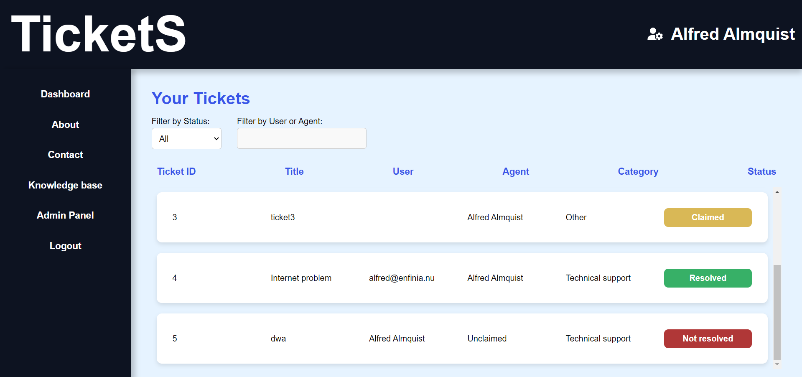

# Ticket system

## Introduction

Welcome to TicketS, a full-stack web application designed to help your company manage tickets efficiently. This project integrates modern technologies to provide a user-friendly interface for creating, assigning, and tracking tickets.

TicketS profile dashboard (agent view).


## How to Use

### Prerequisites

Before running this application, ensure that you have the following installed and configured:

### 1. System requirements
- **Node.js**: The application is built using Node.js. Node.js comes with npm to handle package dependencies.
- **Express.js**: The application uses the Express.js framework.
- **MariaDB**: The application uses mariaDB as the database management system.

### 2. Server requirements
- **Linux server**: The application is designed to run on a linux server.
- **Node.js**: Ensure that Node.js is installed on the server to run the application.
- **MariaDB**: Install MariaDB on the server to handle the database.

### 3. Auth0 requirements
- **Auth0 account**: Create an Auth0 account to handle user authentication.
- **Auth0 application**: Create an application in Auth0 to handle user authentication.
- **Roles**: Create roles in Auth0 to handle user permissions.
- **Configure user token**: Configure the user token to include the user's roles.

### 4. Gmail requirements
- **Gmail account**: Create a gmail account to handle the application emails.

---

### Build

### 1. Environment

a. Install Node.js
```bash
sudo apt update
sudo apt install -y nodejs npm
```
b. Initiate the application
```bash
git clone <url>
```
c. Install dependencies
```bash
cd <application root>
npm install
```

### 2. Database

a. Install mariadb
```bash
sudo apt install mariadb
```
b. Create user
```bash
sudo mysql
CREATE USER <username@localhost> IDENTIFIED BY <password>;
GRANT ALL PRIVILEGES ON *.* TO <username@localhost>;
FLUSH PRIVILEGES;
EXIT;
```
c. Create the database by running the reset script.
```bash
cd sql/db/
mysql -u <username> -p<password> < reset.sql
```

### 3. Auth0

a. Create an Auth0 account.

b. Create an application in Auth0.
* Go to Applications > Applications > Create application.
* Select a name and pick regular web application.
* Select Node.Js (Express) as technology.
* Select "I want to integrate with my app".
    * Set callback URL http://<ip>:<port>/callback.
    * Set logout URL http://<ip>:<port>/login.
    * Skip the rest of the steps.

c. Configure user token to include user roles.
* Go to Actions > Library > Create action.
* Select "Build from scratch".
* Name it "Add roles to token", pick login / post login and select Node 18 (Recommended).
* Add this code to the action:

```bash
exports.onExecutePostLogin = async (event, api) => {
const namespace = 'https://ticketsystem/';  // Custom namespace for custom claims
const assignedRoles = (event.authorization) ? event.authorization.roles : [];

// Add roles to ID Token
api.idToken.setCustomClaim(`${namespace}roles`, assignedRoles);
};
```

* Now go to Actions > Triggers > Post-login.
* Add the created action to the trigger in order to add roles to the token.

d. Add roles and users
* Go to User management > Roles
* Create the following roles:
    * user
    * agent
* Go to User management > Users.
    * Here you can add users and give them the appropriate roles. This can be seen as a sort of "super-admin" as only the person with the login to the Auth0 account can add users and roles.

### Gmail

a. Create a gmail account that will be used by the application.

b. Set up 2FA.

c. Create an application password.

d. Enable IMAP
* Go to Settings > See all settings > Forwarding POP/IMAP.
* Enable IMAP
* Enable Auto-explunge

---

### Configuration

Locate the config file, config/config.json.

a. Configure mariadb.
```bash
"mariadb": {
    "host": "<ip>",
    "user": "<mariadb user>",
    "password": "<mariadb password>",
    "database": "db_ticket",
    "multipleStatements": true
}
```
* Replace ip with your server's ip address.
* Replace user with your mariadb user.
* Replace password with your mariadb password.

b. Configure Auth0.
```bash
"auth0": {
    "secret": '<Auth0 secret>',
    "baseURL": 'http://localhost:1337',
    "clientID": '<Auth0 client id>',
}
```

* Replace secret with you auth0 application secret.
* Replace baseURL with your server's base url.
* Replace clientID with your auth0 application client id.

c. Configure multer
```bash
"multer": {
    "fileLimit": "<Desired file amount limit>"
}
```

* Limit the amount of files that can be uploaded to a ticket. (standard is 3.)

d. Configure Imap
```bash
"imap": {
    "user": "<your email>",
    "password": "<your application password>"
}
```
* Replace user with your email.
* Replace password with your application password that you created earlier.

e. Configure logout route
```bash
"logout": {
    "ip": "<ip>",
    "port": "<port>"
}
```
* Replace ip with your ip address.
* Replace port with the port that is running your application.

---

### Test

Currently, there are no automated tests included in this project.

---

### Run

Start the application:
```bash
cd <application root>
node index.js
```

---

## License

MIT License

Copyright (c) 2024 Alfred Almquist

Permission is hereby granted, free of charge, to any person obtaining a copy
of this software and associated documentation files (the "Software"), to deal
in the Software without restriction, including without limitation the rights
to use, copy, modify, merge, publish, distribute, sublicense, and/or sell
copies of the Software, and to permit persons to whom the Software is
furnished to do so, subject to the following conditions:

The above copyright notice and this permission notice shall be included in all
copies or substantial portions of the Software.

THE SOFTWARE IS PROVIDED "AS IS", WITHOUT WARRANTY OF ANY KIND, EXPRESS OR
IMPLIED, INCLUDING BUT NOT LIMITED TO THE WARRANTIES OF MERCHANTABILITY,
FITNESS FOR A PARTICULAR PURPOSE AND NONINFRINGEMENT. IN NO EVENT SHALL THE
AUTHORS OR COPYRIGHT HOLDERS BE LIABLE FOR ANY CLAIM, DAMAGES OR OTHER
LIABILITY, WHETHER IN AN ACTION OF CONTRACT, TORT OR OTHERWISE, ARISING FROM,
OUT OF OR IN CONNECTION WITH THE SOFTWARE OR THE USE OR OTHER DEALINGS IN THE
SOFTWARE.